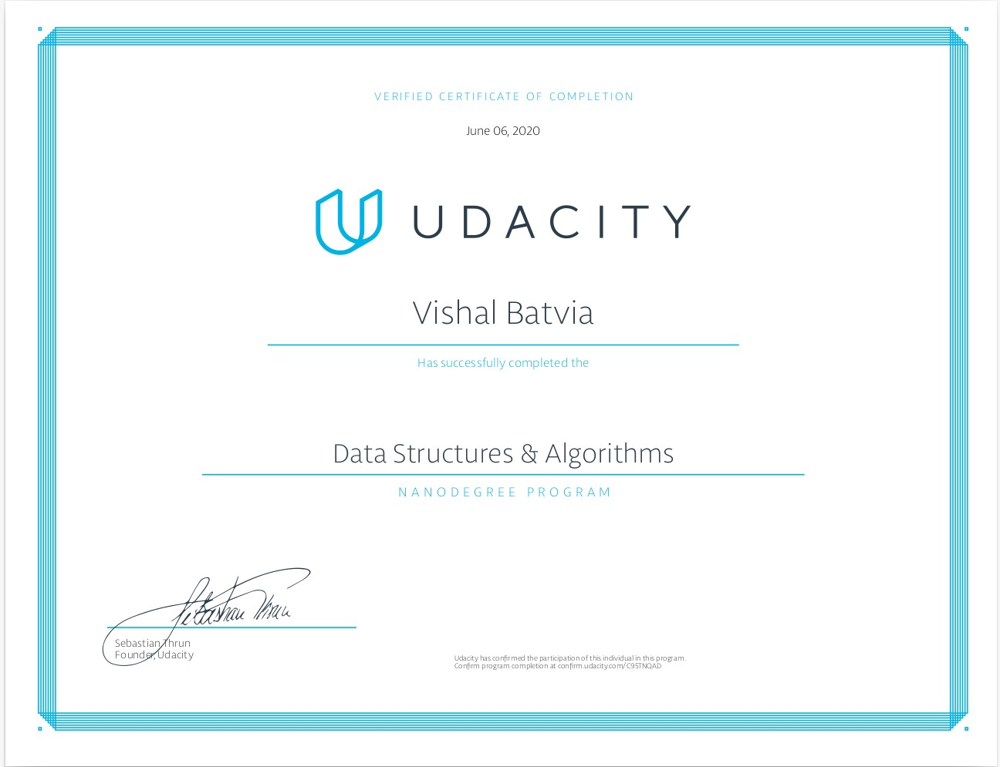

# Data_Structure_And_Algorithms
Udacity Nanodegree

## 1 Basic Python 
## 2 Basic Datastructure
- Least Recently Used Cache
- File Recursion
- Huffman Coding
- Active Directory
- Blockchain
- Union and Intersection of Two Linked Lists
## 3 Basic Algorithm
- Finding the Square Root of an Integer
- Search in a Rotated Sorted Array
- Rearrange Array Elements
- Dutch National Flag Problem
- Autocomplete with Tries
- Max and Min in a Unsorted Array
- HTTPRouter using a Trie
## 4 Advanced Algorithm
- A* algorithm
